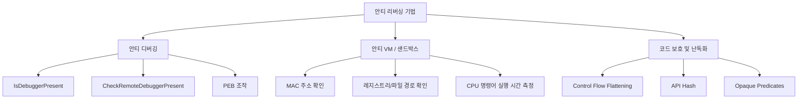

# 70620.6 안티 리버싱 대응 전략

드롭퍼(Dropper)는 최종 페이로드를 안전하게 전달하기 위해 분석가의 분석을 방해하는 다양한 **안티 리버싱(Anti-Reversing)** 기법을 내장하고 있습니다. 본 섹션에서는 드롭퍼에서 주로 사용되는 안티 리버싱 기법의 원리와 이를 우회하는 대응 전략을 심층 분석합니다.

## 1. 안티 리버싱 기술 개요

안티 리버싱은 크게 안티 디버깅, 안티 VM, 코드 난독화, 패킹 기술로 구분됩니다.



## 2. 주요 안티 디버깅 기법 및 대응

### 2.1 API 기반 탐지 (Windows API)
가장 기초적인 단계로, 시스템 API를 호출하여 디버깅 중인지 확인합니다.

- **IsDebuggerPresent()**: 현재 프로세스가 사용자 모드 디버거에 의해 디버깅 중인지 확인합니다.
- **CheckRemoteDebuggerPresent()**: 특정 프로세스가 디버깅 중인지 확인합니다.

**[Python 예제: IsDebuggerPresent 탐지 및 우회 컨셉]**
```python
import ctypes

def check_debugger():
    is_debugger_present = ctypes.windll.kernel32.IsDebuggerPresent()
    if is_debugger_present:
        print("[-] Debugger detected! Exiting...")
        return True
    return False

# 우회 전략: 디버거에서 EAX 레지스터 값을 0으로 강제 설정하거나, 
# PEB(Process Environment Block)의 BeingDebugged 플래그를 0으로 패치함.
```

### 2.2 PEB (Process Environment Block) 직접 참조
API 호출 없이 메모리 상의 PEB 구조체를 직접 읽어 `BeingDebugged` 플래그를 확인합니다.

- **x86**: `FS:[0x30]`
- **x64**: `GS:[0x60]`

## 3. 안티 가상화 (Anti-VM) 및 가상 환경 탐지

드롭퍼는 분석 장비(VMware, VirtualBox)나 자동 분석 샌드박스를 탐지하여 실행을 멈춥니다.

### 3.1 아티팩트 기반 탐지
- **MAC 주소**: `00:05:69` (VMware), `08:00:27` (VirtualBox)
- **파일/디렉토리**: `C:\windows\System32\Drivers\Vmmouse.sys` 등
- **레지스트리**: `HKEY_LOCAL_MACHINE\HARDWARE\Description\System\SystemBiosVersion`

### 3.2 타이밍 기반 탐지 (Timing Attack)
명령어 실행 시간의 차이를 측정하여 가상화 환경을 식별합니다. `RDTSC` 명령어를 주로 사용합니다.

**[Go 예제: RDTSC를 이용한 분석 환경 탐지]**
```go
package main

import (
	"fmt"
	"time"
)

func getTSC() uint64 {
	// 실제 환경에서는 어셈블리 명령어를 사용하여 RDTSC 값을 읽음
	return uint64(time.Now().UnixNano())
}

func main() {
	start := getTSC()
	// 지연을 유발하는 더미 코드
	for i := 0; i < 1000; i++ {}
	end := getTSC()

	diff := end - start
	fmt.Printf("Time difference: %d\n", diff)

	if diff > 100000 { // 임계값 설정
		fmt.Println("[!] Virtual Environment or Analysis Tool Detected!")
	} else {
		fmt.Println("[+] Native Environment.")
	}
}
```

## 4. 대응 전략 및 분석 기법

### 4.1 정적 분석 단계의 대응
- **언패킹(Unpacking)**: UPX, VMProtect 등 실행 압축 및 보호 도구 해제.
- **코드 복구**: 난독화된 제어 흐름을 정규화.
- **심볼릭 실행**: 복잡한 조건식을 수학적으로 풀이하여 실행 경로 예측.

### 4.2 동적 분석 단계의 대응
- **스크립팅 활용**: ScyllaHide와 같은 플러그인을 사용하여 디버거 존재 은폐.
- **후킹(Hooking)**: 안티 리버싱 API 호출을 가로채어 정상 값으로 변조.
- **커스텀 가상 환경**: 분석 환경의 아티팩트(MAC, 파일명 등)를 실제 하드웨어 정보로 위장.

## 5. 결론
안티 리버싱 기술은 지속적으로 진화하고 있으며, 특히 최근의 드롭퍼들은 다단계(Multi-stage) 탐지 기법을 사용합니다. 분석가는 단일 기법에 의존하기보다 정적/동적 분석을 병행하며, 각 단계에서 발생하는 비정상적인 실행 흐름을 추적하는 능력이 요구됩니다.
