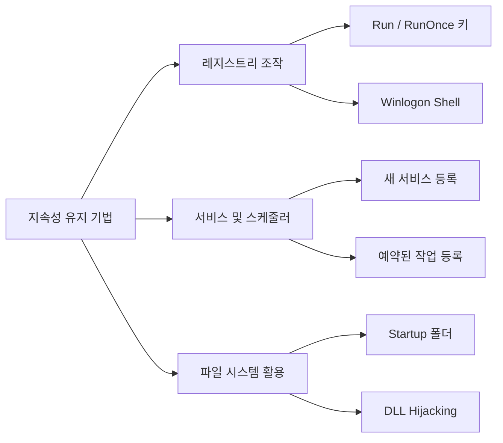

# 70630.2 지속성 유지 기법 분석

공격자가 시스템을 장악한 후 가장 먼저 수행하는 작업 중 하나는 재부팅이나 로그아웃 후에도 악성코드가 자동으로 실행되도록 하는 **지속성 유지(Persistence)**입니다. 본 섹션에서는 윈도우 환경에서 주로 사용되는 지속성 유지 기법을 분석합니다.

## 1. 지속성 유지 기법 분류

지속성 유지 기법은 레지스트리 활용, 파일 시스템 활용, 시스템 설정 변경 등으로 나뉩니다.



## 2. 레지스트리 기반 지속성 유지

가장 전통적이고 흔한 기법으로, 특정 레지스트리 경로에 실행 파일 경로를 등록합니다.

- **Run 키**: `HKEY_CURRENT_USER\Software\Microsoft\Windows\CurrentVersion\Run`
- **Winlogon Shell**: `HKEY_LOCAL_MACHINE\SOFTWARE\Microsoft\Windows NT\CurrentVersion\Winlogon\Shell` (익스플로러 대신 또는 함께 실행)

**[Python 실습: 레지스트리 Run 키 등록 도구]**
```python
import winreg
import os

def add_to_run_key(name, path):
    try:
        # 현재 사용자(HKCU)의 Run 키 오픈
        key = winreg.OpenKey(winreg.HKEY_CURRENT_USER, 
                            r"Software\Microsoft\Windows\CurrentVersion\Run", 
                            0, winreg.KEY_SET_VALUE)
        
        # 값 설정
        winreg.SetValueEx(key, name, 0, winreg.REG_SZ, path)
        winreg.CloseKey(key)
        print(f"[+] Successfully added {name} to Run key.")
    except Exception as e:
        print(f"[-] Failed to add to registry: {e}")

if __name__ == "__main__":
    # malware_path = os.path.realpath("backdoor.exe")
    # add_to_run_key("SystemUpdate", malware_path)
    pass
```

## 3. 서비스 및 예약된 작업 (Scheduled Tasks)

권한이 높은 경우(Administrator), 시스템 서비스나 작업 스케줄러를 사용하여 탐지를 어렵게 만듭니다.

- **서비스(Service)**: 부팅 시점에 시스템 권한으로 실행되도록 설정.
- **예약된 작업(schtasks)**: 특정 시간, 로그인 시점, 혹은 유휴 상태일 때 실행되도록 설정.

## 4. DLL 하이재킹 (DLL Hijacking)

정상 프로그램이 필요한 DLL을 로드할 때, 우선순위가 높은 경로(프로그램 실행 경로 등)에 악성 DLL을 위치시켜 정상 프로세스 내에서 악성 코드가 실행되게 합니다.

## 5. 분석 및 탐지 방법

분석가는 다음과 같은 아티팩트를 조사하여 지속성 유지 여부를 확인해야 합니다.

1.  **Autoruns 도구 사용**: Sysinternals의 Autoruns를 사용하여 모든 자동 실행 지점 전수 조사.
2.  **레지스트리 모니터링**: `Regmon`이나 `Procmon`을 통해 레지스트리 쓰기 행위 추적.
3.  **이벤트 로그 분석**: 
    - Event ID 4697 (서비스 설치)
    - Event ID 4698 (예약된 작업 생성)

## 6. 결론

지속성 유지 기법은 공격자가 목표를 달성할 때까지 시스템에 머물 수 있게 해주는 생명줄과 같습니다. 단순한 레지스트리 등록부터 정교한 DLL 하이재킹까지 다양한 기법이 존재하므로, 포렌식 관점에서의 체계적인 아티팩트 분석이 필수적입니다.
