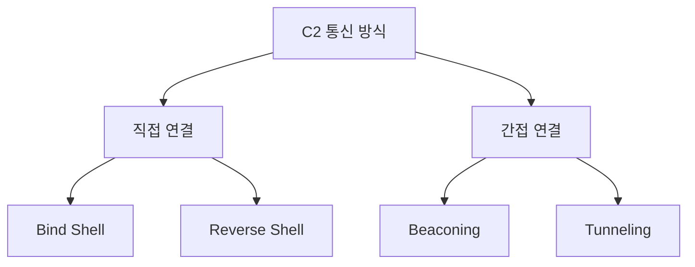

# 70630.3 C2 통신 프로토콜 심층 분석

백도어의 핵심 가치는 원격 제어에 있으며, 이를 가능케 하는 것이 **C2(Command and Control) 통신**입니다. 공격자는 보안 장비의 탐지를 우회하기 위해 다양한 통신 프로토콜과 은닉 기법을 사용합니다. 본 섹션에서는 C2 통신의 구조와 최신 트렌드를 분석합니다.

## 1. C2 통신 아키텍처 및 유형

공격 방식에 따라 직접 연결과 간접 연결 방식으로 나뉩니다.



- **Beaconing**: 일정 주기마다 C2 서버에 접속하여 수행할 작업이 있는지 확인하는 방식 (탐지 회피에 유리).
- **Tunneling**: 정상 프로토콜(HTTP, DNS, ICMP) 내부에 악성 데이터를 실어 보내는 방식.

## 2. 주요 은닉 프로토콜 분석

### 2.1 HTTP/HTTPS 비콘
가장 흔한 방식으로, 정상적인 웹 트래픽으로 위장합니다.
- **특징**: 특정 URL 패턴, 고유한 User-Agent 사용.
- **분석**: 패킷의 URI, Cookie, Post Data 내부의 암호화된 명령어 식별.

### 2.2 DNS 터널링 (DNS Tunneling)
DNS 쿼리(TXT 레코드 등)를 사용하여 데이터를 송수신합니다.
- **특징**: 방화벽이 DNS 트래픽(UDP 53)을 대부분 허용한다는 점을 악용.
- **분석**: 비정상적으로 긴 도메인 네임, 대량의 TXT 레코드 요청 로그 확인.

## 3. 통신 데이터 암호화 및 인코딩

C2 통신 데이터는 대부분 암호화되어 있어 단순 패킷 분석으로는 내용을 알기 어렵습니다.

- **인코딩**: Base64, Hex 등 (단순 우회용).
- **암호화**: RC4, AES, RSA (명령어 및 데이터 보호).
- **커스텀 알고리즘**: 보안 솔루션을 무력화하기 위해 자체적으로 설계한 연산 활용.

**[Python 실습: 간단한 C2 명령어 인코딩/디코딩 예시]**
```python
import base64

def encode_command(command):
    # 단순 XOR 연산과 Base64 조합 예시
    key = 0xAA
    xor_result = bytearray([ord(c) ^ key for c in command])
    return base64.b64encode(xor_result).decode()

def decode_command(encoded_str):
    key = 0xAA
    decoded_bytes = base64.b64decode(encoded_str)
    return "".join([chr(b ^ key) for b in decoded_bytes])

if __name__ == "__main__":
    cmd = "whoami /all"
    encrypted = encode_command(cmd)
    print(f"[*] Encrypted: {encrypted}")
    print(f"[*] Decrypted: {decode_command(encrypted)}")
```

## 4. C2 탐지 및 분석 전략

네트워크 모니터링을 통해 다음과 같은 이상 징후를 식별해야 합니다.

1.  **주기적 통신(Heartbeat)**: 고정된 시간 간격으로 발생하는 연결 요청 추적.
2.  **도메인 평판**: 생성된 지 얼마 안 된 도메인(New Domain)이나 DGA(Domain Generation Algorithm) 패턴 탐지.
3.  **데이터 불균형**: 수신(Inbound) 데이터보다 송신(Outbound) 데이터가 압도적으로 많은 경우(정보 유출 의심).

## 5. 결론

현대의 C2 통신은 단순한 데이터 전송을 넘어, 보안 솔루션과의 고도의 심리전 및 기술전을 포함합니다. 분석가는 네트워크 계층에서의 트래픽 분석뿐만 아니라, 엔드포인트에서 통신 모듈이 데이터를 어떻게 암호화하고 복호화하는지에 대한 리버싱 역량을 동시에 갖추어야 합니다.
