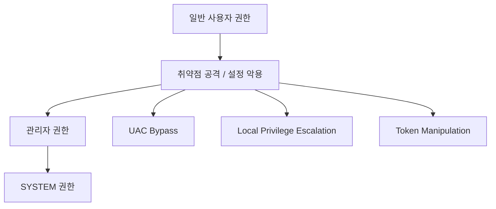

# 70630.5 권한 상승 기법 역공학

백도어가 설치된 직후, 공격자는 제한된 사용자 권한을 시스템 전체를 제어할 수 있는 **관리자(Administrator)나 시스템(SYSTEM) 권한**으로 승격시키려 합니다. 본 섹션에서는 백도어에서 주로 사용되는 권한 상승(Privilege Escalation) 기법을 역공학적 관점에서 분석합니다.

## 1. 권한 상승 프로세스 개요

권한 상승은 시스템의 취약점이나 잘못된 설정을 이용합니다.



## 2. UAC 우회 (UAC Bypass)

사용자 계정 컨트롤(UAC)은 허가되지 않은 변경을 방지하는 보안 기능입니다. 공격자는 이를 우회하기 위해 신뢰할 수 있는 바이너리(Auto-elevated binaries)의 동작을 이용합니다.

- **Fodhelper 기법**: `fodhelper.exe`가 레지스트리 키를 참조하여 명령을 실행할 때, 해당 레지스트리 값을 수정하여 악성 코드를 관리자 권한으로 실행하게 함.
- **분석 포인트**: `HKEY_CURRENT_USER\Software\Classes\ms-settings\Shell\Open\command` 레지스트리 수정 행위 확인.

## 3. 토큰 조작 (Token Manipulation)

프로세스의 접근 권한을 정의하는 **액세스 토큰(Access Token)**을 훔치거나 복제하여 다른 사용자의 권한을 획득합니다.

- **Token Impersonation**: 시스템 권한으로 실행 중인 프로세스(예: lsass.exe)의 토큰을 복제하여 현재 프로세스에 적용.
- **기술**: `OpenProcessToken`, `DuplicateTokenEx`, `SetThreadToken` API 사용.

**[Go 실습: 현재 프로세스의 토큰 정보 확인 컨셉]**
```go
package main

import (
	"fmt"
	"golang.org/x/sys/windows"
)

func getProcessToken() {
	var token windows.Token
	// 현재 프로세스 핸들 획득 및 토큰 오픈
	err := windows.OpenProcessToken(windows.CurrentProcess(), windows.TOKEN_QUERY, &token)
	if err != nil {
		fmt.Printf("[-] Failed to open token: %v\n", err)
		return
	}
	defer token.Close()

	// 토큰 사용자 정보 획득
	user, err := token.GetTokenUser()
	if err != nil {
		return
	}
	
	sidString := user.User.Sid.String()
	fmt.Printf("[+] Current Token SID: %s\n", sidString)
	
	if sidString == "S-1-5-18" {
		fmt.Println("[!] Running as SYSTEM!")
	}
}

func main() {
	getProcessToken()
}
```

## 4. 커널 취약점 악용 (LPE Exploit)

OS 커널의 버그(메모리 손상 등)를 이용하여 직접 권한을 획득합니다. 이는 가장 강력하지만, 시스템 충돌(BSOD)의 위험이 있습니다.

- **Dirty Pipe (Linux)**, **PrintNightmare (Windows)** 등의 취약점 활용.
- **분석 포인트**: 비정상적인 드라이버 로드 및 커널 메모리 직접 수정 패턴 분석.

## 5. 분석 대응 및 방어 전략

1.  **권한 최소화**: 서비스 계정에 필요 이상의 권한을 부여하지 않음.
2.  **모니터링**: 
    - `SeDebugPrivilege`와 같은 위험한 권한 활성화 로그 감시.
    - UAC 우회에 자주 사용되는 레지스트리 키에 대한 쓰기 권한 제한 및 감시.
3.  **패치 관리**: 알려진 LPE 취약점에 대한 정기적인 보안 패치 적용.

## 6. 결론

권한 상승은 공격자가 시스템의 완전한 장악을 위해 반드시 거쳐야 하는 문턱입니다. 백도어 분석가는 해당 악성코드가 어떤 방식(UAC 우회, 토큰 탈취, 커널 공격 등)으로 이 문턱을 넘으려 하는지 식별하고, 시스템의 약점이 어디에 있는지 파악하여 보완해야 합니다.
