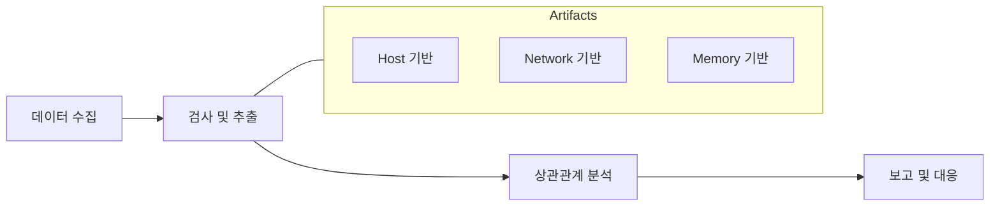

# 70630.7 포렌식 관점의 백도어 추적

백도어 사고가 발생했을 때, 분석가는 시스템에 남겨진 흔적을 추적하여 침투 경로, 동작 방식, 유출 데이터 범위를 파악해야 합니다. 본 섹션에서는 **디지털 포렌식(Digital Forensics)** 관점에서의 백도어 추적 방법론을 다룹니다.

## 1. 백도어 아티팩트 분석 라이프사이클

침해 사고 분석은 수집, 검사, 분석, 보고의 과정을 거칩니다.



## 2. 호스트 기반 아티팩트 (Host-based Artifacts)

### 2.1 파일 시스템 분석
- **MFT (Master File Table)**: 파일 생성/수정/액세스 시간(MAC Time) 분석을 통해 백도어 설치 시점 특정.
- **Prefetch / Shimcache**: 백도어 실행 파일의 이름, 실행 경로, 실행 횟수 및 시간 정보 확인.

### 2.2 레지스트리 분석
- **지속성 유지 키**: 앞서 학습한 Run 키, 서비스 등록 정보 등에서 악성 코드 경로 식별.
- **UserAssist**: 사용자가 GUI를 통해 실행한 프로그램 목록 및 시간 확인.

## 3. 네트워크 기반 아티팩트 (Network-based Artifacts)

### 3.1 네트워크 로그 및 패킷
- **Firewall/IDS 로그**: C2 서버 IP로의 연결 기록, 특정 포트(예: 4444, 8080) 사용 기록.
- **Netstat / TCPView**: 현재 활성화된 비정상적인 외부 연결 확인.

### 3.2 DNS 쿼리 로그
- **DGA 추적**: 의미 없는 무작위 문자열로 이루어진 도메인 쿼리 기록 확인.

## 4. 메모리 포렌식 (Memory Forensics)

휘발성 데이터인 메모리는 루트킷이나 파일리스(Fileless) 악성코드 추적에 결정적인 단서를 제공합니다.

- **프로세스 열거**: 은닉된 프로세스 및 부모 프로세스 관계 분석.
- **네트워크 소켓**: 메모리 상에 남아 있는 활성 커넥션 정보 추출.
- **코드 인젝션 확인**: VAD(Virtual Address Descriptor) 분석을 통해 실행 권한이 부여된 비정상 메모리 영역 탐지.

**[Python 실습: 간단한 활성 네트워크 연결 확인 도구]**
```python
import psutil

def trace_network_connections():
    print(f"{'Process':<20} {'PID':<10} {'L-Addr':<25} {'R-Addr':<25} {'Status'}")
    print("-" * 90)
    
    for conn in psutil.net_connections(kind='inet'):
        laddr = f"{conn.laddr.ip}:{conn.laddr.port}"
        raddr = f"{conn.raddr.ip}:{conn.raddr.port}" if conn.raddr else "N/A"
        
        try:
            process = psutil.Process(conn.pid)
            p_name = process.name()
        except:
            p_name = "Unknown"
            
        if conn.status == 'ESTABLISHED':
            print(f"{p_name:<20} {conn.pid:<10} {laddr:<25} {raddr:<25} {conn.status}")

if __name__ == "__main__":
    trace_network_connections()
```

## 5. 타임라인 분석 (Timeline Analysis)

여러 소스에서 수집된 이벤트를 시간순으로 나열하여 공격자의 행위를 재구성합니다.
- **예**: 피싱 메일 수신(10:00) -> 드롭퍼 실행(10:05) -> 백도어 설치(10:06) -> 권한 상승(10:10) -> 데이터 유출 시작(10:30).

## 6. 결론

포렌식 관점의 추적은 단편적인 증거들을 연결하여 하나의 '이야기'를 완성하는 과정입니다. 백도어는 자신의 흔적을 지우려 노력하지만, 현대의 운영체제는 도처에 실행 흔적을 남깁니다. 분석가는 이러한 아티팩트 간의 상관관계를 파악하여 침해 사고의 전체 범위를 규명해야 합니다.
