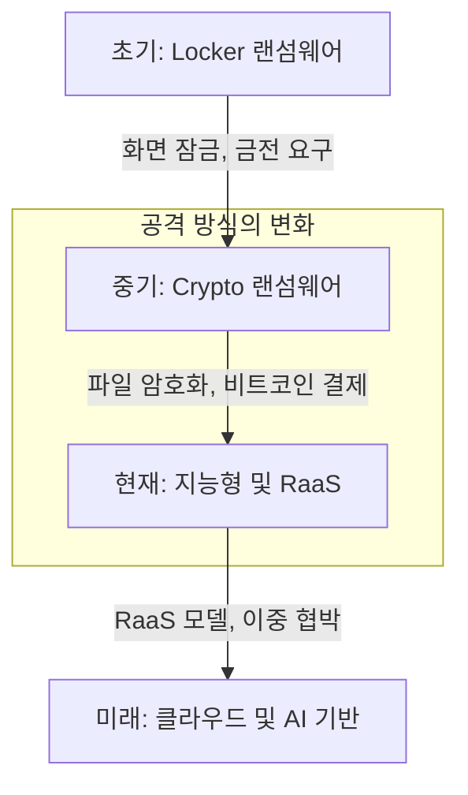
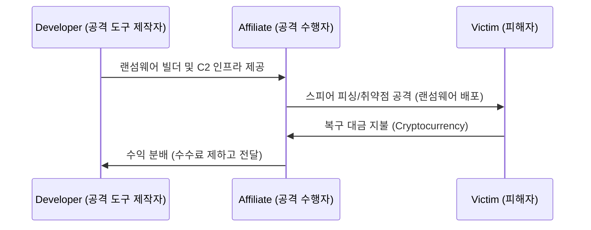

# 70650.1 랜섬웨어의 역사와 최신 공격 동향

## 1. 랜섬웨어의 진화 과정
랜섬웨어는 단순한 잠금 방식에서 지능적인 데이터 탈취 결합 방식으로 진화해 왔습니다.

## 2. RaaS (Ransomware as a Service) 아키텍처
공격자가 랜섬웨어를 직접 개발하지 않고 플랫폼을 빌려 공격하는 비즈니스 모델입니다.

## 3. 이중 협박 (Double Extortion) 기법
단순히 파일을 암호화하는 것에 그치지 않고, 데이터를 사전에 탈취하여 대금을 지불하지 않으면 데이터를 공개하겠다고 위협하는 방식입니다.
*   **1차 협박:** 암호화된 데이터의 복구 대금 요구
*   **2차 협박:** 탈취한 민감 정보의 다크웹 유출 위협
*   **3차 협박 (DDoS):** 대금 지불 압박을 위한 웹 서비스 공격 병행
