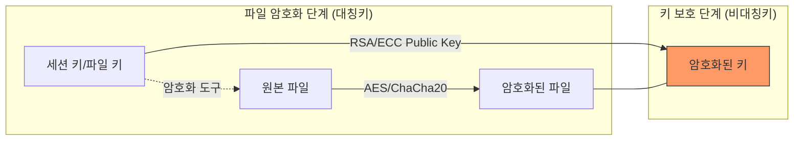

# 70650.2 암호화 메커니즘 심층 분석

## 1. 하이브리드 암호화 구조 (Hybrid Encryption)
랜섬웨어는 대량의 파일을 빠르게 암호화하기 위해 대칭키 알고리즘을 사용하고, 해당 대칭키를 보호하기 위해 비대칭키 알고리즘을 사용합니다.

## 2. 암호화 알고리즘 유형
*   **대칭키 (Symmetric Key):** 
    *   **AES-256:** 가장 널리 사용되는 표준. 하드웨어 가속(AES-NI)을 지원하여 속도가 빠름.
    *   **ChaCha20:** 소프트웨어 구현 시 성능이 우수하며 최신 랜섬웨어에서 선호됨.
*   **비대칭키 (Asymmetric Key):** 
    *   **RSA:** 공개키로 파일 키를 암호화하고, 해커만 가진 개인키로 복호화 가능하게 함.
    *   **ECDH:** 타원곡선 알고리즘을 이용해 키 교환 효율성을 높임.

## 3. 파일 열거 및 선별 기준
악성코드는 모든 파일을 암호화하지 않고, 효율성을 위해 대상을 선별합니다.
*   **제외 폴더:** Windows, Program Files, Boot 등 시스템 부팅에 필요한 폴더 (사용자가 협박 문구를 읽어야 하므로 시스템 파괴는 피함).
*   **타깃 확장자:** .doc, .jpg, .pdf, .db, .xls 등 중요 데이터 파일.
*   **부분 암호화 (Partial Encryption):** 대용량 파일(DB 등)의 경우 파일의 앞부분이나 일정한 간격의 블록만 암호화하여 속도를 극대화함.
